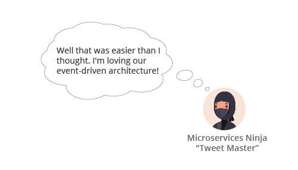
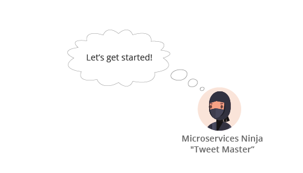
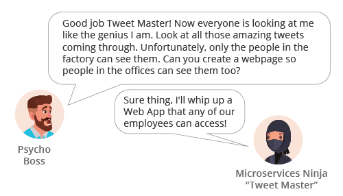

author: Marc DiPasquale and Heinz Schaffner
summary: Using Spring Cloud Streams w/ Solace PubSub+ in OpenSHift
id: solace-codelab-scs-1
categories: spring,scs,cloud-streams,solace,pubsub+,java,pcf
environments: Web
status: draft
feedback link: github.com/Mrc0113/solace-workshop-scs
analytics account: 0

# Developer Workshop: Using Spring Cloud Streams with Solace PubSub+

## CodeLab Overview
Duration: 0:10:00

Using Java & Spring Cloud Streams (SCS) to create Event-Driven Applications with PubSub+ in OpenShift
* The purpose of this codelab is to introduce java developers to creating event-driven applications with Spring Cloud Streams and PubSub+ in RedHat OpenShift and OKD
* “Spring Cloud Stream is a framework for building highly scalable event-driven microservices connected with shared messaging systems."
* It is based on Spring Boot, Spring Cloud, Spring Integration and Spring Messaging

You're a developer that works for an up and coming car company named Edison Automotives. Your boss is not the most adept in the use of social media but he's been hearing great things about Twitter from his inner-circle and is a bit infatuated with tying it into Edison Automotive's everyday business and culture....little does he know that his company does not exactly have the best products or reputation....

Positive
: **Developer Resources** 
Spring Cloud Stream Project Home: [https://spring.io/projects/spring-cloud-stream](https://spring.io/projects/spring-cloud-stream) 
The latest version of Spring Clouds Streams as of the creation of this lab is Greenwich.SR1 (2.1.4)
The Reference Guide for that current version is available [here](https://docs.spring.io/spring-cloud-stream/docs/current/reference/htmlsingle).

Negative
: The SCS framework allows for building messaging-driven applications without having to explicitly write any code for publishing or receiving events.  While many microservices-oriented applications today are based on synchronous, request/response interactions based on protocols such as HTTP or gRPC, the asynchronous, event-driven nature of communications using SCS allows for building highly scalable, efficient and responsive distributed systems that can run on-premise or in the cloud.  When combined with the high-performance Solace PubSub+ Event Broker which can be deployed in virtually any environment, you can create powerful and flexible applications that support both hybrid and multi-cloud capabilities, all operating in real-time with high throughput and low latency. 

## Set-up & Prerequisites
Duration: 0:20:00


### Developer IDE & Code Access
#### IDE Setup
The recommended IDE for the workshop is Spring Tools Suite (STS) [Download Here](https://spring.io/tools). STS comes with some niceties, such as autodeploy, when used with spring-boot-devtools. Participants can of course use another IDE if preferred. It is also recommended that you begin the workshop with an empty STS workspace to avoid any unforeseen issues with existing projects/configurations/code.  

Required libraries: 
* Maven 3.5.3 or higher (ensure it's on your PATH) [Install steps here](https://maven.apache.org/install.html)
* Use the latest JDK 1.8 (ensure your PATH & JAVA_HOME are updated as needed)
* If using STS/Eclipse ensure your JDK 1.8 is thei default "Installed JRE" by choosing "Windows" -> "Preferences" -> "Java" -> "Installed JREs"
* If the correct JDK does not already have a checkmark next to it then click the "Add" button, choose "Standard VM", click "Next", navigate to your JDK -> Click "Finish". Then click the checkbox next to the added JRE and click "Apply and close"  

#### Code Access
* Fork the github repository for the Workshop from:

``` 
https://github.com/SolaceTraining/solace-workshop-scs/tree/openshift-solution
```

* OR Navigate to https://github.com/SolaceTraining/solace-workshop-scs, **Choose the openshift-solution branch**, click "Fork 
* Download or Clone your Forked repo to you working host.
* Import the projects into STS

In STS, use the File -> Import -> Maven -> Existing Maven Projects -> Click Next -> Click Browse and Navigate to the git repo you cloned in the previous step -> Select all the pom files and click Finish. 

After importing everything you should see the following projects in STS: 
``
01-scs-workshop-common
02-scs-source-tweets
03-scs-sink-analytics
04-scs-sink-twitterboard
05-scs-processor-feature
06-scs-processor-dynamicfeature
07-scs-sink-bossideas
08-scs-processor-yelling
09-scs-processor-positive
10-spring-boot-mqttwebapp
``

Negative
: Note: There may be errors associated with the template projects as they are incomplete and will be addressed in the exercises that follow.

###
* The workshop uses a common data model which contains the Tweet object which is processed by the SCS services. You will need to prepare the shared artifact for use across the projects. 
* Throughout this workshop we have three options when deploying apps: 1) via an OpenShift Templae and 2) via mvn on the command line for local testing and 3) Using STS to compile the application for local testing. 
* If you prefer option 1 then in the *01-scs-workshop-common* project, run a Maven build and install it to the local repository. 


* If you will need to intall the common tweet object reference. Navigate to the 01-scs-workshop-common directory and perform a maven install of the project.

``` bash
$ cd ~/git/solace-workshop-scs/01-scs-workshop-common/
$ mvn clean install
```

### Create and/or Verify access to a Solace PubSub+ Service

#### PubSub+ Service in Solace Cloud
If you want to stand up your Solace PubSub+ Service in Solace Cloud go ahead and login or signup at the [Cloud Signup Page](https://console.solace.cloud/login/new-account).  Note that a free tier is available and will work for this workshop. 

#### Local Solace PubSub+ Instance
When developing your application, you may want to test using a local instance of the Solace PubSub+ Event Broker.  Refer to the Solace [Docker Getting Started Guide](https://solace.com/software/getting-started/) to get you up and running quickly with a broker instance running in Docker.  You may skip this step if you decide to use a broker running in OpenShift,  PCF, Solace Cloud or any pubic/private Cloud IaaS.

#### PubSub+ Service in OpenShift
It is possible to install Solace PUbSub+ brokers directly into the OpenShift project. The samples in this workshop assume that the Solace broker is installed in OpenShift, however, this is not madatory. To get more details on installing the
PubSub+ broker into OpenShift, please visit:
``` 
https://github.com/SolaceLabs/solace-openshift-examples
```

## Deploy Your First Source & Sink
Duration: 0:45:00


### Application Architecture
At the end of this section we will have created the apps below!
The Source will send out tweets that will be received by the marketing Sink. 


Negative
: SCS Provides 3 Binding Interfaces:
1: Sink - "Identifies the contract for the message consumer by providing the destination from which the message is consumed."
2: Source - "Identifies the contract for the message producer by providing the destination to which the produced message is sent."
3: Processor - "Encapsulates both the sink and the source contracts by exposing two destinations that allow consumption and production of messages."

### Deploying a Source

Before our company can do anything with the tweets we have to start to receive an incoming stream of them!  Let's get started! Please navigate to the "02-scs-source-tweets" project in your IDE.

#### Learn the Project Structure
Before we take a look at the code, let's take a quick look at the structure of a Spring Cloud Streams project.  

* As a java developer you'll probably see a familiar project setup. You have your main application under src/main/java and unit tests under src/test/java.


Negative
: Spring Cloud Streams is built on top of Spring Boot. A great resource for creating your own Spring Boot applications is Spring Initializr. A publically hosted version is hosted here: [start.spring.io](https://start.spring.io)

### 
* Next go ahead and open up the pom.xml file in your "02-scs-source-tweets" project and search for "binder"; you should have a dependency for either "spring-cloud-starter-stream-solace" or "spring-cloud-stream-binder-solace" which is what is going to allow SCS to connect to Solace PubSub+. "spring-cloud-starter-stream-solace" includes the "spring-cloud-stream-binder-solace" dependency which is why you could have either one. It is recommended to start with the starter.
* Note that the "spring-cloud-stream-reactive" dependency is only required for reactive streams support, but we will also discuss the use of "Spring Cloud Functions" as an alternative in a later section.


* Let's take a look at a simple sample implementation in the image below. You can see that the enrichLogMessage method is associated with both an INPUT and OUTPUT channel. In a future section we will create an application following a similar pattern, but notice that if you look at the *ScsSourceTweets.java* class in your "02-scs-source-tweets" project you will see something a bit different. We are using an *@InboundChannelAdapter* annotation in order to create our fake tweets at a fixed rate. 

Negative
: "Spring Cloud Stream is built on the concepts and patterns defined by Enterprise Integration Patterns and relies in its internal implementation on an already established and popular implementation of Enterprise Integration Patterns within the Spring portfolio of projects: Spring Integration framework." By using Spring Integration we can make use of familiar annotations such as *@InboundChannelAdapater, @Transformer or @ServiceActivator*


* One last thing to look at and then we'll deploy your first source! Go ahead and open your application.yml file. This file holds the bindings that tells the SCS binder how to connect your input/output channels to the specified middleware at runtime.  


Positive
: SCS apps are not restricted to only using one binder at a time. This allows a SCS app the flexibility of receiving events from one binder/location/environment/etc, performing business logic and then sending new events to another binder/location/environment/etc. 
Also note that because bindings are dynamically configured at run-time you don't have to touch the code to switch out your binder of choice, environment info, etc. 

#### Deploy our 02-scs-source-tweets app
* First open the *application.yml* file and update the host, msgVpn, clientUsername & clientPassword to match your PubSub+ environment. When obtaining the connect info note that the SCS solace binder uses the Solace Java API with the SMF protocol. (Keep this connection info handy as you'll need it several more times throughout this lab!)
* If using STS, start the app by right clicking on the project and choosing "Run As" -> "Spring Boot App"
* If not using STS, open a cli and navigate to the project's directory and then run 

``` 
bash
$ mvn spring-boot:run
```

* Whichever way you started the app you should see the app start, connect and begin to send tweets by looking at the console.

* Developer - Awesome! Now we have a stream of tweets coming in! 
* Developer - As marketing requested we just need to capture them so they can perform their analytics.

To do this we will deploy a sink app.  Recall that a sink app binds to an INPUT channel. 

#### Deploying a Sink
* Open the "03-scs-sink-analytics" project 
* Take a look at the code in the *ScsSinkAnalytics.java* class; you'll notice we have a very simple class with only a few methods. As we saw earlier, the *@StreamListener* attribute identifies which channel our *sink* method will receive events from. Also notice that the sink method is expecting a POJO tweet parameter of type *Tweet*
* Now update the *application.yml* file for the "03-scs-sink-analytics" project with the same info that you used when deploying the source app.
* Time to deploy!  Deploy the "03-scs-sink-analytics" app the same way you started "02-scs-source-tweets"
* Now that your sink is started you should see it logging the tweets as they come in! 

Negative
: Note that Spring Cloud Streams [provides message converters](https://docs.spring.io/spring-cloud-stream/docs/current/reference/htmlsingle/#_provided_messageconverters) which enable the conversion of a payload to/from a specified format/shape (such as a Tweet POJO in our case) based on the argumentType in the method signature and the contentType specified on the message. The default content type is application/json.

### 
* Developer - Woohoo! We've deployed our first SCS source and sink applications and the marketing department is now getting the stream of tweets as they requested! Time to give our boss the good news.

Positive
: You now have a source application sending events to a sink application via an external eventing system, but notice that you didn't need to use any messaging APIs! SCS provides this abstraction and makes it possible for developers to concentrate on their business logic rather than learning proprietary messaging APIs!

## Deploy to OpenShift
Duration: 0:20:00


### OpenShift Source-to-Image (S2I)

OpenShift provides the capability of taking the source code from a Repository (for example GitHub) and automatically creating a repo clone, compiling from the clone, form the docker image, place the image into the OpenShift project image repository and the run the image as a Pod. Essentially, deploying OpenShift templates that reference S2I images can automatically deploy applications as pods directly from the source code.

#### Requirements for S2I

To be able to utilize the S2I capabilities requires that a S2I image that supports the source code language and compiler directives is loaded into the OpenShift project (or a project referencable from the users project). The most common S2I image for Java/Maven is provided as part of OpenShift xPaaS images.

The XpaaS images are usually loaded as part of the Standard RedHat OpenShift install. The image that the workshop template uses is the **redhat-openjdk18-openshift** S2I image. 

If you are using an OKD OpenShift environment, such as Minishift, you will need to load the xPaaS images. The images are loaded using the miniahift addon option. After the addon is loaded you need to move a copy of the S2I image to your project (which in this sample the project is called *solace*), for example:
```
docker login -u solace -p $(oc whoami -t) 172.30.1.1:5000
docker pull 172.30.1.1:5000/openshift/redhat-openjdk18-openshift:1.4
docker tag 172.30.1.1:5000/openshift/redhat-openjdk18-openshift:1.4 172.30.1.1:5000/solace/redhat-openjdk18-openshift:latest
docker push 172.30.1.1:5000/solace/redhat-openjdk18-openshift:latest
```

There are also common public domain Java/Maven S2I images available. A popular S2I alternative to the xPaaS image is found at:
```
https://github.com/jorgemoralespou/s2i-java
```

#### Loading the SCSt project to OpenShift via Template

Included in the OpenShift training branch is an OpenShift tempalate that can be used to create the running Pod directly from the source code in the GitHub project.  lthough there were changes in he local *application.yaml* file, they are ignored by the template and are overwritten by memory variables defined for the docker image in the template. The template also makes use of paramters that can be used from the OpenShift console or the CLI.

To load the template for the first time is just a matter of referencing the local Solace **SpringWorkshop.yml** file and add it to the current project. If you loaded the file from the local repo you shoud see:
 


if you click create you should be passed to the next screen. You will need to update a couple of the paramter options, but it should look similar to the following for the first source application (in this case *02-scs-source-tweets*) :


Negative
: Make sure you change the repository reference to point to your forked repository. Most of the samples will run with the main repository until you get to the last module. Feel free to change the defaults in the OpenShift template in your forked project to make things easier for yourself.

At the bottom of the screen you should see:


At the bottom is a reference for the OpenShift FQDN for the Solace OpenShift Pod that is running the Solace PubSub+ broker. In this case the broker was deployed with a ClusterIP service called *vmr-ci-svc* in a project called *solace*. You will need to add your broker's ClusterIP name here. If the PubSub+ broker you are using is not deployed in OpenShift, then simply add the brokers IP or DNS name here instead.

Once you click the *create* buttom you will be prompted to store the template. Click the radio box to agree. This means from now on the Template can be recalled directly from you OpenShift Project repository. 

At this point the template will create and run the Pod bsed on the source code. When complete you should see somehting similar to:


The deployment logs and the Solace PubSub+ broker should confirm the Spring application is connected to the broker.

### Deploy the Source to OpenShift

Before you deploy the Source to OpenShift, you can deploy locally and test the applicaiotn first. To test locally you need to first change to the directory where the source application was cloned and make sure the *pom.xml* file is in the current directory. Next prepare the jars and then run the Spring-Boot application with :

```
mvn clean package
mvn spring-boot:run
```

If the application runs and starts generating tweets, you are good to go.

To deploy this same application, just make use of the template as described above.
 
### Deploy the Sink to OpenShift

Deploying the sink application is the same as for the source application. Make sure you are in the *03-scs-sink-analytics* directory. You can deploy locally to test and then use the OpenShift Template to deploy to OpenShift.  
You may want to also run the source application to see the tweets arriving in the SCSt Sink application. 

## Discover the ease of 1-to-Many with Publish-Subscribe
Duration: 0:10:00


### Application Architecture
At the end of this section we will have added the Factory Tweet Board Sink. 


### Creating the Tweet Board Sink
We obviously don't have a giant LED board that we can use so we're going to settle for logging the tweets as they come in. 
* Open the "04-scs-sink-twitterboard" project
* Open the *ScsSinkTweetBoard.java* class
* Add the *@EnableBinding(Sink.class)* annotation to label the app as a Sink
* Add a "sink" method that takes in a "Tweet" POJO from the INPUT channel and logs that it was received. 
* Update the application.yml file, verify that there is indeed a destination configured for the input channel, and add your name to the end of the destination name (e.g: TWEETS.Q.BOARD.Marc).  Note that by not specifying a group we are using the "Publish-Subscribe" messaging model. 
* If not deploying to PCF you'll also need to update the host, msgVpn, clientUsername, clientPassword in the application.yml file. 

Negative
: Spring Cloud Streams supports multiple messaging models. We are going to use two different ones in this workshop
1: Publish-Subscribe allows for an application to process all events sent to the defined subscription. It also allows new applications to be added to the topology without disruption of the existing flow.  
2: Consumer Groups allow for a set of applications to participate in a "group" to consume messages. This option is commonly used to allow the ability for an application to scale horizontally (creating multiple instances of the same application) while only processing each event once.


### Deploying the Tweet Board
At this point we have created our "04-scs-sink-twitterboard" application and it needs to be deployed. 
Time to see if you've been paying attention! Deploy it in the same way you deployed the apps in the previous section. 



Positive
: Notice that the publisher (Source) application did not need to be modified in order for another consumer (Sink) application to receive the stream of tweets. There are two takeaways here: 
1: The publish-subscribe paradigm allows for the publisher to send data once and not care whether 0,1,2 or 100 applications are subscribed on the other end. It just send the data and moves on. 
2: Developing event driven applications allows for decoupling of your sending and receiving applications. This powerful concept allowed our company to add new functionality without touching our already operational applications. 

## Creating your first Processor
Duration: 0:30:00

So far in this workshop we have created source or sink applications. In this section we will create our first processor.


### Application Architecture
In order to meet our new goal we will add the Features processor and a new Sink as seen below. 


### Create the Feature Processor



#### Processor with a Custom Binding Interface	
* Open the "05-scs-processor-feature" project
* Note that we have the same project setup as the source and sink apps from the previous section and the pom file doesn't have any extra dependencies to create a Processor. 
* Now open the *ScsProcessorFeatures.java* class.
* Note that our *@EnableBinding* Annotation is specifying the *ProcessorOneInTwoOutBinding* class; this is because we have specified a custom interface to have 2 output channels (one for tweets with features, and one for all other tweets)

Positive
: Custom binding interfaces can be defined in order for your SCS app to have additional input or output channels. They also allow for custom naming of channels. 

### 
* Note that in the application.yml file the bindings that are listed include input, outputFeature, and outputNoFeature as defined in our custom bindings interface. 
* If not using PubSub+ in PCF, update the host, msgVpn, clientUsername, clientPassword in the application.yml file so we can connect to the PubSub+ service

#### Processor using Dynamic Destinations
Negative
: At this point you might be thinking "Okay these custom binding interfaces are great, but what if I don't know how many or what to call my output channels at design time?" Spring Cloud Streams supports the use of Dynamic Destinations for this exact situation!  Dynamic destinations allow you to use business logic to define your destinations at runtime. 

### 

* Let's create a second feature processor that makes use of dynamic destinations. 
* Open the "06-scs-processor-dynamicfeature" project
* Open the *ScsProcessorFeaturesDynamic.java* class
* You'll notice that the *@EnableBinding* annotation defines the app as a "Sink" app. This is because we only bind the INPUT channel at startup and then at runtime we are using a *BinderAwareChannelResolver* (which is registered automatically by the *@EnableBinding* annotation) to dynaimcally create output channels. 

Negative
: From the JavaDocs, the *BinderAwareChannelResolver* is "A DestinationResolver implementation that resolves the channel from the bean factory and, if not present, creates a new channel and adds it to the factory after binding it to the binder."

###
* Review the *handle* method to see an example of how to specify dynamic destinations
* Build (mvn clean install) & Deploy the app to OpenShift

Positive
: Note that our two different feature processors are listening as part of a consumer group so they will receive messages in a round robin fashion

### Create the Feature Sink for the Boss
* Open the "07-scs-sink-bossideas" project
* Open the *ScsSinkBossideas.java* class
* Add the *@EnableBinding(Sink.class)* annotation to label the app as a Sink
* Add a "sink" method that takes in a "Tweet" POJO from the INPUT channel and logs that it was received. 
* Update the application.yml file and verify that there is indeed a destination & group configured for the input channel. Note that by specifying a group we are now using the consumer group model. Since this application will likely do further processing in the future we want to provide the option of scaling up to keep up with the number of events that come in.
* At this point we have created our "07-scs-sink-bossideas" application and it needs to be deployed. Time to see if you've been paying attention! Deploy it in the same way you deployed the apps in the previous section. 

### Update the Tweet Board Subscription
Note that our processor that we created earlier in this lab publishes to multiple topics essentially splitting our feed into two. Due to our new requirements to not show new features on the twitter board we need to update that sink appropriately.
* Navigate to your "04-scs-sink-twitterboard" project
* Open your application.yml file
* Update the queueAdditionalSubscriptions property to listen on "tweets/stream/nofeatures"
* Save the file
* Redeploy the updated App form the Build menu by rebuilding the application.


Negative
: spring-boot-devtools is handy for development and adds features such as automatic restart and remote debugging. Click [here](https://www.baeldung.com/spring-boot-devtools) for a high level overview of some of the functionality it provides. 

Positive
: Notice that the use of topic hierarchies provides an organized way of keeping track of your event streams. This ability, combined with the ability to wildcard in PubSub+ gives your applications an easy way to subscribe to the exact event streams necessary to meet your need. Don't underestimate the value of creating a well-defined topic hierarchy! A few best practices to keep in mind are: start general and become more specific as more levels are added, use short words or abbrevations as topics can only be so long, and don't mix upper and lower case! A good topic hierarchy might be defined as "\<country\>/\<state\>/\<locality\>" which would allow you to subscribe to all events in a given country "canada/>" or even subscribe to events from all 1,716 localities named San Jose no matter what country or state they're in "\*/\*/sanjose"  

## Reactive with Spring Cloud Streams
Duration: 0:10:00


Negative
: Spring Cloud Streams currently has two different ways to follow a Reactive (Functional) Programming Model: Spring Cloud Functions and spring-cloud-stream-reactive. We're going to concentrate on Spring Cloud Functions since the latter option is marked for deprecation.

### Application Architecture
We're going to add a "No Yelling" processor in our event driven architecture in order to meet this new need.


### Deploying a SCS Processor using Spring Cloud Functions
* Navigate to your "08-scs-processor-yelling" project
* Open your pom.xml file and note that it was not necessary to include Spring Cloud Functions as a dependency. It's included as a dependency of the "spring-cloud-steam" artifact.
* Open the *ScsProcessorYelling.java* class and note that although we still have the *@EnableBinding(Processor.class)* annotation we are now bindings a bean of type "java.util.function.Function" to the external destinations by providing the spring.cloud.stream.function.definition property.

Negative
: Spring Cloud Functions supports 3 types that conveniently map to our 3 SCS binding interfaces. 
 java.util.function.Function maps to a SCS Processor
 java.util.function.Supplier maps to a SCS Source
 java.util.function.Consumer maps to a SCS Sink

### 
* Now that we've seen how to create a SCS app using Spring Cloud Functions go ahead and deploy it. 
* After deploying you should start to see the BEFORE and AFTER log entries scrolling across the console where the AFTER log entries do not contain any uppercase letters in the text field. 

Positive
: From the Spring docs, Spring Cloud Functions allows you to "Decouple the development lifecycle of business logic from any specific runtime target so that the same code can run as a web endpoint, a stream processor, or a task."  Read more here: [https://spring.io/projects/spring-cloud-function](https://spring.io/projects/spring-cloud-function)


## Multiple Processor Chaining
Duration: 0:15:00


Negative
: Obviously this company has some morality issues :) 
In the real world you should definitely not modify people's speech or create fake news!  

### Application Architecture
A processor will be added to our architecture in order to convert negative words to positive ones.


### Create the Processor
Let's get started and hopefully have a bit of fun! 
* Open the "09-scs-processor-positive" project
* Open the manifest.yml file and change <ATTENDEE_NAME> to your name
* Open the application.yml file and change **both** <ATTENDEE_NAME> placeholders with your name (in the input group & output destination)
* Find & Open the *ScsProcessorPositive.java* class. At this point we know how to create and deploy a processor so we'll do something a bit different. At the top of the class you'll see that the negToPosMap object is being initialized in a static method. This Map holds the key for changing our negative tweets to positive ones. Go ahead and fill in some positive words for each negative one in the map. Remember that you can find the canned tweets in the canned_tweets.txt file under the "02-scs-source-tweets" project if you need some more context :) 
* After filling in your "positive" words go ahead and deploy the app

Positive
: Notice that multiple processors can easily be connected together in order to form a processing chain. 

### Update the Tweet Board Subscription
* Navigate to your "04-scs-sink-twitterboard" project
* Open your application.yml file
* Update the queueAdditionalSubscriptions property to listen on "tweets/stream/nofeatures/noyelling/positive/<ATTENDEE_NAME>" **replacing <ATTENDEE_NAME> with your name**
* Save the file
* Redeploy the updated App by rebuilding the build that was deployed by the template.

## Painless Multi-protocol with MQTT
Duration: 0:10:00



### Application Architecture
To meet this new requirement we are going to add the MQTT Web App shown in the diagram below:


Positive
: Since we're using Solace PubSub+ as our event broker we support a bunch of open standards and protocols. Even though the SCS apps are sending/receiving events using the Java API other applications can still use their language/protocol of choice. 

### Obtain PubSub+ Credentials for an App that can't use the Cloud Connector & Auto-config
The required credentials for access to the PubSub+ broker will be the same as those that were used in the *application.yml* file or the sting used in the OpenShift template when the application was deployed.

### Create the Web App
* Since we're Spring experts let's go ahead and whip up a quick Spring Boot app that uses JavaScript and the open source MQTT Paho library to connect to PubSub+ and receive the stream of tweets.  
* Open the "10-spring-boot-mqttwebapp" project
* Check out the *pom.xml* file and notice that there is nothing spring-cloud-streams related; only spring boot! 
* Then open up the *mqttListener.html* to see how simple it was to connect & receive events using MQTT Paho. 
* In *mqttListener.html* update the host/port/username/credentials to connect to PubSub+ (Search for "UPDATE" to find where the updates need to be made) using the information found in the previous subsection.
* Lastly look at the *MqttWebApp.java* class.  You'll see that we just have a simple RestController that is smart enough to make the files in src/main/resources/static available for HTTP access.
* Now that we've taken a look at how the app works go ahead and deploy it. 
* Once deployed navigate to *http://**LOOKUP YOUR ROUTE**/mqttListener.html* to see the incoming tweets! You can lookup your route in the apps manager or by using the command below:


Negative
: Note that the MqttWebApp is actually running locally in your browser. This paradigm of creating credentials in the PubSub+ service can be used to connect other external apps as well!

## Review & Continued Learning!
Duration: 0:05:00

### Review


Positive
: Hopefully you not only learned how to use Spring Cloud Streams today, but also how it enables developers to concentrate on achieving business goals by removing the need to learn messaging APIs. You should also now have a solid understanding of how implementing an event-driven architecture allows for loose coupling between your apps which enables rapid addition of new functionality. 

### Continued learning topics: 

This course was just an introduction to Spring Cloud Streams, but we've included some resources below if you're interested in learning more about it or some of the features that complement it! Happy Learning :) 

* [Error Handling](https://docs.spring.io/spring-cloud-stream/docs/current/reference/htmlsingle/#spring-cloud-stream-overview-error-handling)
* [Content Based Routing](https://docs.spring.io/spring-cloud-stream/docs/current/reference/htmlsingle/#_using_streamlistener_for_content_based_routing)
* [Functional Composition with Spring Cloud Functions](http://cloud.spring.io/spring-cloud-stream/spring-cloud-stream.html#_functional_composition)
* [Content Type Negotiation](https://docs.spring.io/spring-cloud-stream/docs/current/reference/htmlsingle/#content-type-management)
* [Actuator for metrics](https://docs.spring.io/spring-cloud-stream/docs/current/reference/htmlsingle/#spring-cloud-stream-overview-metrics-emitter)
* [Sleuth for tracing](https://cloud.spring.io/spring-cloud-sleuth/single/spring-cloud-sleuth.html)

## Markdown Syntax Backup
Duration: 0:00:00

``` Java
public static void main(String args[]){
  System.out.println("Hello World!");
  }
```

Positive
: This will appear in a green info box.

Negative
: This will appear in a yellow info box.

 [Example of a Link](https://www.google.com)

Adding an image


* List
* using 
* bullets

###

1. List
1. Using
1. Numbers
